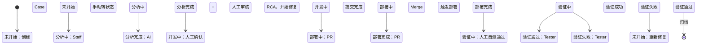

# AI Sherlock 后管系统需求文档

> 本文档定义 AI Sherlock 后台管理系统的功能需求，包括组织架构、权限模型、Case 生命周期管理等核心模块。

## 1. 组织架构层级

```
Organization（组织）
  └── Group（组）
        ├── Staff（成员）
        └── Project（项目）
              └── Case（问题单）
```

### 1.1 层级关系说明

| 层级 | 说明 | 关联关系 |
|---|---|---|
| **Organization** | 顶层组织，对应公司或团队 | 包含多个 Group |
| **Group** | 工作组，按业务线或团队划分 | 属于一个 Organization，包含多个 Staff 和 Project |
| **Project** | 具体项目，对应一个代码仓库或产品 | 属于一个 Group，包含多个 Case |
| **Case** | 问题单，由插件提交或人工创建 | 属于一个 Project |

---

## 2. 权限模型

### 2.1 角色定义

| 角色 | 权限范围 | 说明 |
|---|---|---|
| **管理员（Admin）** | 全局 | 创建/管理 Group、Project、Staff，拥有最高权限 |
| **Owner** | Group 级 | Group 负责人，管理组内 Staff，分配 Case，拥有组内所有权限 |
| **Staff（Dev/Tester）** | Project 级 | 普通成员，可查看所在 Group 内所有 Project 的 Case 列表；仅被分配时才能修改状态 |

### 2.2 权限矩阵

| 功能 | 管理员 | Owner | Dev | Tester |
|---|---|---|---|---|
| 创建 Group | ✅ | ❌ | ❌ | ❌ |
| 管理 Group Staff | ✅ | ✅ | ❌ | ❌ |
| 创建 Project | ✅ | ❌ | ❌ | ❌ |
| 查看 Case 列表 | ✅ | ✅（组内） | ✅（组内 Project） | ✅（组内 Project） |
| 修改 Case 状态 | ✅ | ✅ | ✅（被分配时） | ✅（验证时） |
| 分配 Case | ✅ | ✅ | ✅（可自分配） | ❌ |
| AI 分析 | ✅ | ✅ | ✅ | ❌ |
| AutoFix | ✅ | ✅ | ✅ | ❌ |
| 验证 Case | ✅ | ✅ |  | ✅ |

---

## 3. 认证与注册

### 3.1 登录方式

| 场景 | 认证方式 | ID 格式 |
|---|---|---|
| **外网** | Google OAuth 登录 | 谷歌邮箱地址 |
| **内网** | SSO 单点登录 | 工号/邮箱（保留扩展能力） |

### 3.2 自动注册

- Staff 首次登录时，若账号不存在，系统自动创建账号
- 新账号默认无 Group 归属，需管理员或 Owner 邀请加入 Group

---

## 4. 管理员功能

### 4.1 Group 管理

**创建 Group**
- 输入 Group 名称、描述
- 指定 Owner（从 Staff 列表选择）
- 关联 Organization

**Group 操作**
- 编辑：修改名称、描述、Owner
- 删除：删除 Group（需确认，级联处理 Project 和 Staff 关系）
- 查看：Group 详情、成员列表、关联 Project 列表

### 4.2 Staff 管理

**添加 Staff 到 Group**
- 搜索 Staff（按邮箱/姓名）
- 指定角色：Owner / Dev / Tester
- 一个 Group 通常只有一个 Owner，其他为普通 Staff

**Staff 操作**
- 移除：从 Group 中移除 Staff
- 角色变更：调整 Staff 在 Group 内的角色
- 查看：Staff 详情、所属 Group 列表

### 4.3 Project 管理

**创建 Project**
- 输入 Project 名称、描述
- 关联 Group（一个 Project 只能属于一个 Group）
- 配置仓库信息（用于 AutoFix 和 PR 流程）

**Project 操作**
- 编辑：修改名称、描述、仓库配置
- 删除：删除 Project（需确认，级联处理 Case）
- 查看：Project 详情、Case 列表、成员列表

---

## 5. Owner 功能

### 5.1 Group 内 Staff 管理

- 添加/移除 Staff（同管理员功能，但仅限本 Group）
- 调整 Staff 角色（Dev ↔ Tester）
- 查看 Staff 工作量、Case 分配情况

### 5.2 Case 分配

**分配规则**
- Owner 可以将 Case 分配给 Group 内任意 Staff
- Staff 也可以主动将 Case 分配给自己（自分配）
- 任何人都可以分配给任何人（通常限 Group 内）
- 新 Case 默认状态为【未开始】，无 assignee

**分配流程**
1. Owner 或 Staff 在 Case 列表点击【Assign】
2. 选择 Group 内的 Staff
3. Case 的 assigneeId 被设置（状态不变，仍为【未开始】）
4. 被分配的 Staff 收到通知（可选）
5. Staff 手动将状态从【未开始】改为【分析中】

---

## 6. Case 生命周期管理

### 6.1 状态流转图



### 6.2 各状态详细说明

#### 6.2.1 未开始（Pending）

**触发条件**
- 插件提交新 Case
- 验证失败，重新进入

**可见性**
- 管理员：所有 Case
- Owner：Group 内所有 Project 的 Case
- Staff：Group 内所有 Project 的 Case（支持筛选条件：`assigneeId == 当前 StaffId` 查看"分配给我的"）

**权限说明**
- 查看：Staff 可查看 Group 内所有 Case
- 修改状态：仅当 Case 被分配给当前 Staff 时（`assigneeId == 当前 StaffId`）

**可执行操作**
- Assign：分配给 Staff（仅设置 assigneeId，不自动变更状态）
- 转状态：Staff 手动将状态从【未开始】改为【分析中】

---

#### 6.2.2 分析中（Analyzing）

**触发条件**
- Case 被 Assign 给 Staff

**功能**
- **人工分析**：Staff 查看插件收集的证据（截图、录屏、Network/Console/Error）
- **AI 分析**：点击【AI 分析】按钮，触发后端诊断服务
  - 后端拉取日志、堆栈、代码上下文
  - 返回 Root Cause Analysis（RCA）结果
  - 支持对话式交互，人工可追问直到满意
- **人工补齐**：若 AI 分析结果为空或不满意，人工填写 RCA 并落库

**可执行操作**
- 点击【AI 分析】
- 填写/编辑 RCA
- 转状态为【分析完成】

---

#### 6.2.3 分析完成（Analyzed）

**触发条件**
- RCA 已确认（AI 生成或人工填写）

**通知**
- Tester 收到 RCA 信息推送（Chrome 插件红点提示）
- Tester 可在插件端查看 RCA 详情

**可执行操作**
- Staff/Dev 手动转状态为【开发中】

---

#### 6.2.4 开发中（Developing）

**触发条件**
- 人工确认 RCA 后，点击转状态

**功能**
- **人工提 PR**：Staff 手动创建 PR，回填 PR 链接到 Case
- **AutoFix（AI 自动修复）**：
  - 点击【AutoFix】按钮
  - AI 根据 RCA 自动生成修复代码
  - 自动创建 PR（一个仓库一个 PR）
  - PR 信息自动回填到 Case

**可执行操作**
- 提交 PR（人工或 AutoFix）
- 转状态为【部署中】

---

#### 6.2.5 部署中（Deploying）

**触发条件**
- PR 已提交，点击转状态

**自动化流程**
1. 系统自动执行 PR Merge
2. Merge 触发 CI/CD 发布流程
3. 部署完成后，Webhook 回调后端
4. 后端自动更新 Case 状态为【部署完成】

**可执行操作**
- 等待自动流程完成（无需人工干预）

---

#### 6.2.6 部署完成（Deployed）

**触发条件**
- Webhook 回调确认部署成功

**功能**
- Dev 进行 UAT 自测
- 自测通过后，手动转状态为【验证中】

**可执行操作**
- 转状态为【验证中】

---

#### 6.2.7 验证中（Verifying）

**触发条件**
- Dev 自测通过，转状态

**通知**
- Tester 收到验证任务推送（Chrome 插件红点）
- Tester 在插件端看到待验证 Case 列表

**Tester 验证流程**
1. 点击 Case，打开 Report 页面
2. 查看 RCA、修复内容、部署信息
3. 在真实环境验证问题是否解决
4. 填写验证 Comment：
   - **验证通过**：提交 Comment，状态变为【验证通过】
   - **验证失败**：提交 Comment，状态变为【验证失败】（等价于【未开始】）

**可执行操作**
- 提交验证结果（通过/失败）

---

#### 6.2.8 验证通过（Verified）

**触发条件**
- Tester 确认验证通过

**后续**
- Case 可归档
- Chrome 插件增加【归档 Tab】展示已验证 Case

---

#### 6.2.9 验证失败（Failed）

**触发条件**
- Tester 验证发现问题

**后续**
- 状态回退到【未开始】
- 重新进入修复流程（Assign → 分析 → 开发 → 部署 → 验证）

---

## 7. AI 功能集成

### 7.1 AI 分析（Root Cause Analysis）

**触发方式**
- 后管界面点击【AI 分析】按钮
- 插件端也可触发（待实现）

**输入**
- Case 信息（标题、描述、步骤）
- 插件收集的证据（截图、录屏、Network/Console/Error）
- 后端拉取的日志、堆栈、代码上下文

**输出**
- Root Cause 描述
- 推荐修复方案
- 置信度评分
- 相关文件定位（仓库、文件、行号）

**交互模式**
- 支持对话式追问
- 人工可标记结果是否满意
- 不满意可继续对话直到找到 RCA

### 7.2 AutoFix（AI 自动修复）

**触发条件**
- RCA 已确认
- 点击【AutoFix】按钮

**流程**
1. AI 根据 RCA 生成修复代码
2. 自动创建 Git Branch
3. 提交代码变更
4. 创建 Pull Request
5. PR 信息回填到 Case（PR 链接、Branch 名称）

**约束**
- 一个仓库一个 PR
- PR 需人工 Review 后 Merge（或配置自动 Merge）

---

## 8. 通知与推送

### 8.1 通知场景

| 场景 | 接收人 | 通知方式 |
|---|---|---|
| Case 被 Assign | Staff | 后管站内信 + 邮件（可选） |
| RCA 分析完成 | Tester | Chrome 插件红点 |
| 部署完成 | Dev | 后管站内信 |
| 待验证 | Tester | Chrome 插件红点 + 推送 |

### 8.2 Chrome 插件集成

**红点提示**
- 插件侧边栏 Cases Tab 显示待验证数量红点
- 点击红点展开待验证 Case 列表

**推送实现**
- 后端通过 WebSocket 或轮询推送状态变更
- 插件监听 `chrome.storage.onChanged` 或后台轮询

---

## 9. 待讨论事项

1. **通知推送实现方式**：WebSocket vs 轮询 vs Server-Sent Events
2. **AutoFix 代码 Review 流程**：是否强制人工 Review 后才能 Merge
3. **Group 跨 Organization**：是否允许一个 Group 属于多个 Organization
4. **Case 权限细化**：是否需要支持 Project 级权限（不同 Staff 看不同 Case）
5. **审计日志**：是否需要记录所有状态变更和操作日志
6. **多仓库支持**：一个 Project 是否可能关联多个仓库

---

## 10. 与插件端对接

### 10.1 插件端已有功能

- Case 提交（`POST /api/v1/plugin/issues`）
- Case 列表查询（`GET /api/v1/cases`）
- Case 详情查询（`GET /api/v1/cases/:caseKey`）
- 待验证红点提示（基于 `PENDING_VERIFICATION` 状态）

### 10.2 待新增功能

- Case 状态变更通知推送
- RCA 信息实时同步
- 验证结果提交（Comment + 状态变更）
- Assign 功能（插件端自分配）

---

> **文档版本**：v1.0  
> **最后更新**：2026-09-08  
> **状态**：初稿，待评审
