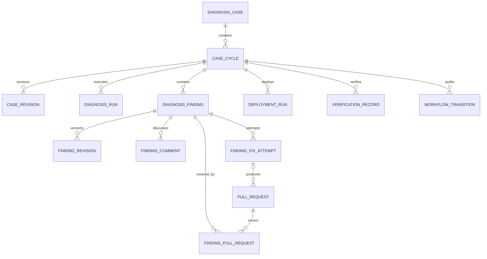
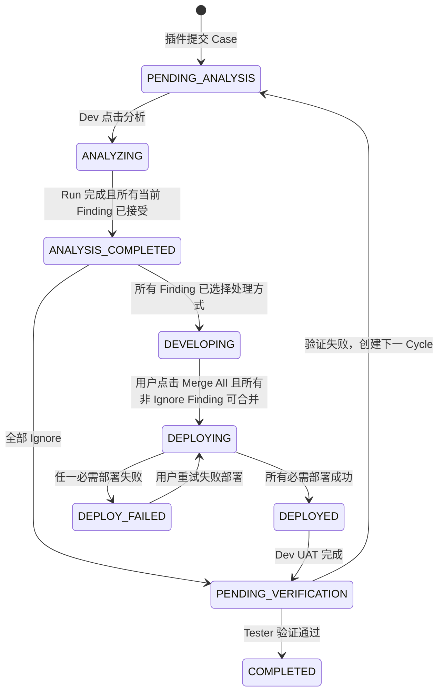
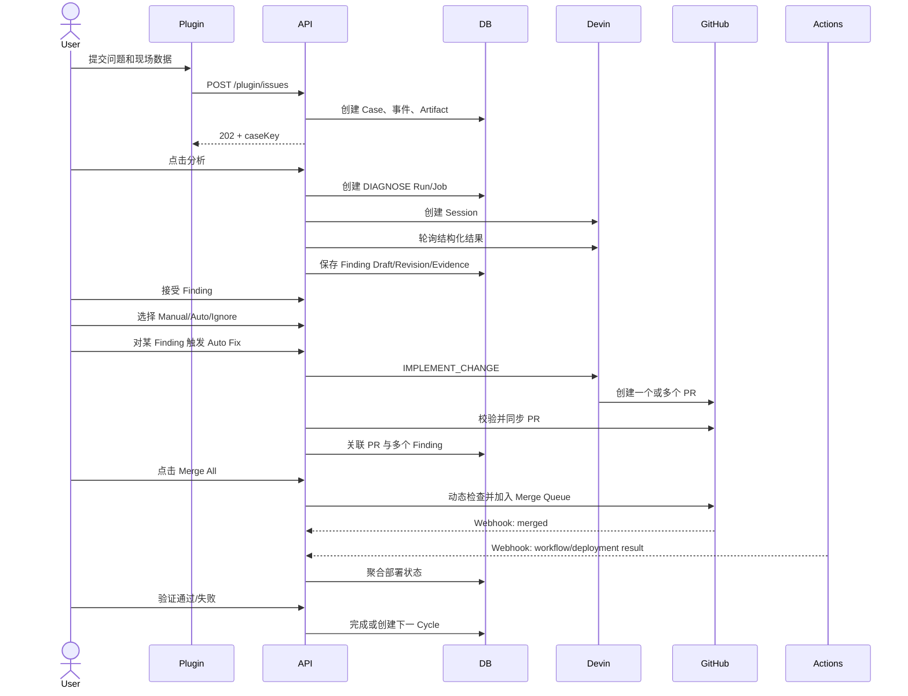

# AI Sherlock Case 全生命周期架构设计

文档版本：`1.1-draft`  
更新时间：`2026-09-08`  
适用范围：浏览器插件、AI Sherlock 后端、管理端、Devin、GitHub、GitHub Actions，以及未来的 JIRA 集成

## 1. 文档目的

本文定义 AI Sherlock 从用户提交 Case，到 AI 诊断、人工确认 Finding、手动或自动修复、PR 合并、部署和验证的完整领域模型与系统边界。

本文同时区分：

- **当前实现**：现有 Spring Boot POC 已具备的能力。
- **目标设计**：本轮讨论确定、后续需要通过 Flyway 和代码逐步实现的能力。

本文不是数据库迁移脚本，也不表示目标接口已经可以调用。实际开发应按第 16 节的实施阶段推进。

## 2. 已确认的业务决策

1. 一个 Case 对应一个 JIRA Issue。
2. 插件提交 Case 后不自动启动 Devin 诊断；由 Dev 在管理端显式点击“分析”。
3. 一个 Case 可以有 `0..N` 个 Finding。
4. Devin 返回零 Finding 时，允许系统生成推荐草稿，用户补充并确认人工 Finding。
5. Finding 的多轮对话式分析只更新当前 Finding，不覆盖历史结果。
6. 一个 Finding 是独立的分析与 Auto Fix 入口，但一个 PR 可以同时解决多个 Finding。
7. 一个 Finding 可以有多次 Fix Attempt；失败后重试会新增 Attempt，不覆盖旧 Attempt。
8. 所有当前 Finding 都被用户接受后，Case 才能结束分析阶段。
9. 每个 Finding 必须选择 `MANUAL_FIX`、`AUTO_FIX` 或 `IGNORE`。
10. 全部 Finding 都为 `IGNORE` 时，Case 可直接进入待验证，不要求代码部署。
11. Manual Fix 由用户登记 PR，后端需要校验 PR 的真实性和所属范围。
12. Merge All 第一阶段必须由用户显式点击，暂不强制角色权限，但必须记录操作者。
13. 合并前必须动态确认：非 Draft、无冲突、Required Checks 通过、Review 满足、Branch Protection 满足。
14. 多个 PR 的合并不是原子事务，必须允许部分成功并可恢复。
15. PR 合并和部署完成是两个不同事实；GitHub Actions/部署系统成功后才算部署完成。
16. 任一必需部署失败时，Case 进入部署失败；每个部署单元仍保留自己的真实状态。
17. 验证失败会 Reopen 同一个 Case，创建新的 `case_cycle`（其 `cycle_no + 1`），历史 Case 描述、Finding、PR、部署和验证记录全部保留。
18. 当前阶段不接入 JIRA，Case 业务状态以本地数据库状态机为准；未来内网接入后再切换为 JIRA 权威。
19. 当前预留 Dev、Tester、Group Admin、Project Maintainer 等角色和 Case 分配能力，POC 暂不全面强制。
20. Elastic 日志检索当前不实现，只保留 Evidence Provider 扩展点。

## 3. 核心设计原则

### 3.1 业务状态和执行状态分离

Case 的业务阶段、Devin Run 的执行状态、Fix Attempt 状态、PR 状态和部署状态不能复用同一个枚举。

例如：

- Case 可以处于“开发中”。
- 某个 Fix Attempt 可以处于“失败”。
- 另一个 PR 可以处于“等待 Review”。
- 已合并的前端代码可以处于“部署成功”。
- 后端代码可以同时处于“部署失败”。

这些状态必须独立记录，再由聚合规则计算 Case 的业务状态。

### 3.2 历史不可覆盖

下列对象采用追加式历史：

- Case 描述版本。
- Finding 诊断版本。
- 用户与 Devin 的对话消息。
- Diagnosis Run。
- Fix Attempt。
- PR 关联。
- 部署执行。
- 验证结果。
- 工作流状态迁移。

业务表可保存“当前指针”用于快速查询，但历史事实不做原地覆盖或删除。

### 3.3 外部事实由外部系统确认

- Devin 提供诊断与修复建议，但不能单独证明代码已经修复。
- GitHub 是 PR、Review、冲突和 Merge 事实来源。
- GitHub Actions 或部署平台是部署事实来源。
- 当前阶段本地数据库是 Case 业务状态的权威来源；未来正式接入后才由 JIRA 接管。

本地数据库用于编排、缓存、审计和快速查询，不伪造外部系统已经完成的事实。

### 3.4 所有产生外部副作用的动作都要幂等

创建 Devin Session、触发 Auto Fix、登记 PR、加入 Merge Queue、触发部署和同步 JIRA 都可能因网络超时出现“不知道是否成功”的情况，必须使用业务幂等键、外部资源 ID、Outbox 和对账机制避免重复副作用。

## 4. 领域模型



### 4.1 Case

Case 是一次用户问题报告，也是未来对应的一条 JIRA Issue。Case 在 Reopen 时不会创建新的 Case，而是增加 Cycle。

主要属性：

```text
id
case_key
organization_id
group_id
project_id
created_by_user_id
workflow_status
current_cycle_id
current_revision_id
assignee_user_id
source_application
environment
jira_issue_key
version
created_at
updated_at
```

`version` 用于乐观锁，避免两个用户同时操作导致状态被静默覆盖。

`current_cycle_id` 是指向当前 `case_cycle` 的外键。API 返回的 `currentCycleNo` 通过关联的 `case_cycle.cycle_no` 获取，不建议把 `current_cycle_no` 作为唯一归属依据重复存进 Case。

### 4.2 Case Cycle

Cycle 表示一次从分析到验证的完整处理轮次。

```text
case_cycle
- id
- case_id
- cycle_no
- status
- opened_reason
- opened_by
- opened_at
- closed_at
```

建议约束：

```text
UNIQUE(case_id, cycle_no)
同一 Case 最多一个 ACTIVE Cycle
diagnosis_case.current_cycle_id 必须指向该 Case 自己的 Cycle
```

`case_cycle.id` 是各业务记录归属处理轮次的正式外键；`cycle_no` 只是同一个 Case 内用于展示和排序的业务序号。不能只在子表保存裸 `cycle_no`，否则缺少外键约束，也容易在查询时因遗漏 `case_id` 条件而串联到其他 Case 的相同轮次。

以下业务表必须包含非空 `case_cycle_id`：

```text
diagnosis_run
diagnosis_finding
finding_fix_attempt
deployment_run
verification_record
```

与处理轮次有关的关联记录，例如 `finding_pull_request`、`merge_batch` 和 `finding_comment`，也必须记录 `case_cycle_id`。数据库通过外键保证它们引用真实 Cycle；Service 层还必须校验 Cycle、Case、Finding 彼此属于同一个业务范围。

验证失败时：

1. 关闭当前 Cycle，记录验证失败原因。
2. 创建 `cycle_no + 1` 的新 Cycle。
3. Case 回到待分析。
4. 旧 Finding、PR、部署和验证历史保持不变。
5. 用户可以重新启用旧 Finding，也可以新增 Finding。

### 4.3 Case Revision

Case 标题或描述可编辑，但每次编辑新增版本：

```text
case_revision
- id
- case_id
- case_cycle_id
- revision_no
- title
- description
- changed_by
- change_reason
- created_at
```

每个 Diagnosis Run 保存其使用的 `case_revision_id`，确保以后可以还原当时发送给 Devin 的上下文。

### 4.4 Finding

Finding 是针对 Case 的一条独立、可确认、可处理的问题结论。它是 AI Sherlock 的领域概念，不等同于 Devin API 的固定资源类型。

Finding 当前绑定一个主要 Application 和一个主要 Repository。跨仓库问题优先拆分为多个 Finding，其他仓库可作为 Evidence；数据模型仍允许一个 PR 覆盖多个 Finding。

主要属性：

```text
id
case_id
case_cycle_id
carried_from_finding_id
primary_application_id
primary_repository_id
current_revision_id
analysis_status
resolution_type
resolution_status
source
is_current
created_by
created_at
updated_at
```

其中：

```text
analysis_status
- DRAFT
- ACCEPTED

resolution_type
- NULL
- MANUAL_FIX
- AUTO_FIX
- IGNORE

resolution_status
- NOT_STARTED
- IN_PROGRESS
- READY_TO_MERGE
- COMPLETED
- FAILED
```

三个字段分别回答：

| 字段 | 问题 |
|---|---|
| `analysis_status` | 用户是否认可当前分析结论？ |
| `resolution_type` | 用户选择如何处理？ |
| `resolution_status` | 处理过程进展到哪一步？ |

组合示例：

| 场景 | analysis_status | resolution_type | resolution_status |
|---|---|---|---|
| Devin 刚生成 Finding | `DRAFT` | `NULL` | `NOT_STARTED` |
| 用户接受分析，尚未选择处理方式 | `ACCEPTED` | `NULL` | `NOT_STARTED` |
| Auto Fix 正在执行 | `ACCEPTED` | `AUTO_FIX` | `IN_PROGRESS` |
| PR 满足全部合并条件 | `ACCEPTED` | `AUTO_FIX` | `READY_TO_MERGE` |
| Auto Fix 失败，可重试 | `ACCEPTED` | `AUTO_FIX` | `FAILED` |
| Manual PR 已登记但检查未完成 | `ACCEPTED` | `MANUAL_FIX` | `IN_PROGRESS` |
| PR 已合并 | `ACCEPTED` | `MANUAL_FIX/AUTO_FIX` | `COMPLETED` |
| 用户忽略 | `ACCEPTED` | `IGNORE` | `COMPLETED` |

`PR_REGISTERED` 不作为 Finding 状态。PR 是否已登记是 `pull_request` 和关联表中的事实。`SUPERSEDED` 也不作为修复状态，而用于旧 Revision、旧 Attempt 或被替换关联的生命周期标记。

### 4.5 Finding Revision 与对话

Finding 多轮诊断采用稳定 Finding ID 加不可变 Revision：

```text
diagnosis_finding
  ├── finding_revision 1
  ├── finding_revision 2
  └── finding_revision 3  <- current_revision_id
```

`finding_revision` 建议包含：

```text
id
finding_id
case_cycle_id
revision_no
diagnosis_run_id
title
root_cause
recommendation
confidence
payload
status             -- CURRENT / SUPERSEDED
created_at
```

`finding_comment` 建议包含：

```text
id
finding_id
case_cycle_id
author_type        -- USER / DEVIN / SYSTEM
author_user_id
content
diagnosis_run_id
created_at
```

交互规则：

1. 用户针对当前 Finding 增加 Comment。
2. 用户显式点击重新分析。
3. 后端将当前 Revision、相关历史消息、新 Comment 和 Evidence 传给 Devin。
4. Devin 返回后新增 Finding Revision，旧 Revision 标记为 `SUPERSEDED`。
5. Finding 的 `current_revision_id` 指向新版本。
6. `analysis_status` 重置为 `DRAFT`，用户需要重新接受。
7. 已存在的 PR 不删除，但在新 Revision 被接受前不能直接认为仍然覆盖最新结论。

Finding 级重新分析不能偷偷创建、删除或合并其他 Finding。需要重新划分问题边界时，应发起 Case 级重新分析并由用户确认变化。

Finding ID 在同一个 Cycle 的多轮对话内保持稳定。验证失败进入新 Cycle 后，如果用户选择重新启用旧 Finding，系统在新 Cycle 创建一条新的 `diagnosis_finding`，并通过 `carried_from_finding_id` 指向旧 Finding。这样两个 Cycle 的接受状态和修复状态不会互相覆盖，同时可以追溯问题的延续关系。

### 4.6 Diagnosis Run

`diagnosis_run.mode` 表示任务目的，不是 Case 状态：

```text
DIAGNOSE
IMPLEMENT_CHANGE
```

- `DIAGNOSE`：分析 Case 或重新分析某个 Finding。
- `IMPLEMENT_CHANGE`：执行某次 Auto Fix。

每个 Run 必须保存非空 `case_cycle_id`，并保存不可变的上下文快照、Prompt 版本、Schema 版本、Provider 请求响应和结构化输出。

### 4.7 Fix Attempt

Fix Attempt 表示一次具体修复尝试。失败但没有创建 PR 也必须保留记录。

```text
Finding A
  ├── Attempt 1：Devin 超时，没有 PR
  ├── Attempt 2：创建 PR 123，但 CI 失败
  └── Attempt 3：创建 PR 135，最终合并
```

建议属性：

```text
id
case_id
case_cycle_id
primary_finding_id
diagnosis_run_id
attempt_no
provider
provider_session_id
instructions
approval_policy       -- 当前 MANUAL
approval_status       -- 点击 Auto Fix 即 APPROVED
approved_by
execution_status
idempotency_key
result
last_error
created_at
updated_at
```

Fix Attempt 的执行状态继续表达任务执行细节，例如：

```text
QUEUED / IMPLEMENTING / PR_CREATED / NO_CHANGE /
FAILED / TIMED_OUT / NEEDS_ATTENTION
```

它与 Finding 的 `resolution_status` 不应共用枚举。

### 4.8 Pull Request 与 Finding 关联

`pull_request` 保存 GitHub 上真实 PR 的主数据，一条 PR 只保存一次：

```text
pull_request
- id
- provider
- repository_id
- external_id
- number
- url
- source_branch
- target_branch
- head_sha
- state                 -- OPEN / CLOSED / MERGED
- draft
- mergeable_state
- checks_status
- review_status
- branch_protection_status
- origin_type           -- DEVIN / MANUAL
- origin_fix_attempt_id
- merged_sha
- merged_at
- last_synced_at
- raw_snapshot
```

建议唯一约束：

```text
UNIQUE(provider, repository_id, number)
UNIQUE(provider, repository_id, external_id)
```

`finding_pull_request` 只表达 Finding 与 PR 的多对多关系：

```text
finding_pull_request
- case_cycle_id
- finding_id
- pull_request_id
- relation_type          -- PRIMARY / INCLUDED
- source                 -- DEVIN / MANUAL / USER_CONFIRMED
- finding_revision_id
- is_current
- linked_by
- created_at
```

例如，用户从 Finding A 触发 Auto Fix，Devin 创建 PR 123 并报告同时解决 A、B、C：

```text
A -> PR 123, relation_type=PRIMARY,  source=DEVIN
B -> PR 123, relation_type=INCLUDED, source=DEVIN
C -> PR 123, relation_type=INCLUDED, source=DEVIN
```

Devin 返回的 `resolvedFindingIds` 是关联建议，不是不可校验的最终事实。后端必须验证 Finding 属于当前 Case、仓库处于授权范围、PR 真实存在；用户可以调整或确认关联。

目标结构化输出示例：

```json
{
  "pullRequests": [
    {
      "repository": "tonymiao2012/ms-ai-sherlock",
      "number": 123,
      "url": "https://github.com/tonymiao2012/ms-ai-sherlock/pull/123",
      "resolvedFindingIds": ["finding-a", "finding-b", "finding-c"]
    }
  ]
}
```

### 4.9 Deployment Run

PR Merge 和部署必须分开记录：

```text
deployment_run
- id
- case_id
- case_cycle_id
- repository_id
- environment
- workflow_name
- external_run_id
- commit_sha
- status              -- QUEUED / RUNNING / SUCCEEDED / FAILED / CANCELLED
- attempt_no
- url
- started_at
- finished_at
- raw_snapshot
```

一个 Case 涉及多个仓库时，每个仓库独立产生 Deployment Run。聚合规则：

- 所有必需部署成功：Case 可进入部署完成。
- 任一必需部署失败：Case 进入 `DEPLOY_FAILED`。
- 已成功部署项保持成功，重试时只重试失败或过期的部署项。

### 4.10 Assignment 与参与人

当前 Case 使用一个主负责人：

```text
diagnosis_case.assignee_user_id
```

同时预留参与人表：

```text
case_participant
- case_id
- user_id
- role       -- WATCHER / PARTICIPANT / DEV / TESTER
- created_at
```

POC 阶段不强制这些角色，但所有业务动作都必须记录真实 `actor_user_id`，不能相信请求 Body 中传入的用户 ID。

## 5. Case 业务状态机

建议机器状态：

```text
PENDING_ANALYSIS
ANALYZING
ANALYSIS_COMPLETED
DEVELOPING
DEPLOYING
DEPLOY_FAILED
DEPLOYED
PENDING_VERIFICATION
COMPLETED
```

中文展示：

| 机器状态 | 中文状态 |
|---|---|
| `PENDING_ANALYSIS` | 待开始 |
| `ANALYZING` | 分析中 |
| `ANALYSIS_COMPLETED` | 分析结束 |
| `DEVELOPING` | 开发中 |
| `DEPLOYING` | 部署中 |
| `DEPLOY_FAILED` | 部署失败 |
| `DEPLOYED` | 部署完成 |
| `PENDING_VERIFICATION` | 待验证 |
| `COMPLETED` | 验证通过/已完成 |

验证不通过是一次迁移事件，不建议长期保存为当前状态；发生后创建新 Cycle 并回到 `PENDING_ANALYSIS`。



### 5.1 分析完成条件

必须同时满足：

1. 当前 Cycle 至少有一次完成的 Diagnosis Run。
2. 不存在仍在执行或状态不确定的 Diagnosis Run。
3. 所有当前有效 Finding 均为 `analysis_status=ACCEPTED`。
4. 零 Finding 时，用户必须确认“无可执行问题”，或创建并接受人工 Finding。

### 5.2 进入开发中条件

所有当前 Finding 必须：

- 已接受；并且
- 已选择 `MANUAL_FIX`、`AUTO_FIX` 或 `IGNORE`。

### 5.3 Merge All 启用条件

每个非 Ignore Finding 必须至少关联一个当前有效 PR，并且关联 PR 合并后能够覆盖该 Finding。对所有待合并 PR 动态检查：

- PR 仍为 Open。
- 不是 Draft。
- 没有 Merge Conflict。
- Required Checks 针对最新 SHA 全部满足。
- Required Review 已满足。
- Branch Protection 或 Ruleset 满足。
- PR 的仓库、目标分支处于 Project 授权范围。

缓存状态只能用于页面展示，点击 Merge All 时必须重新查询 GitHub。

### 5.4 非原子 Merge

多个 PR 无法与本地数据库组成原子事务。建议引入 `merge_batch`：

```text
merge_batch
- id
- case_id
- case_cycle_id
- requested_by
- status       -- REQUESTED / QUEUING / PARTIAL / COMPLETED / FAILED
- created_at
```

后端逐个将 PR 加入 Merge Queue并记录结果。部分成功时：

- 已入队或已合并 PR 不回滚。
- 未入队 PR 保留失败原因并允许重试。
- Case 保持 `DEVELOPING` 或进入可识别的部分失败技术态。
- 只有全部必需 PR 合并后才继续部署聚合。

## 6. 插件、诊断与修复主流程



### 6.1 Case 类型不再驱动执行模式

插件提交 Case 时不再要求 `issueType`。历史数据中的 `issue_type` 可作为兼容元数据保留，但不能决定是否调用 Devin 修改代码。

执行模式由明确的业务动作决定：

- 用户点击“分析”创建 `mode=DIAGNOSE` 的 Run。
- 用户点击某个 Finding 的 Auto Fix 创建 `mode=IMPLEMENT_CHANGE` 的 Run。

旧的 Case 级 `change_request` 和 `/change-request/approval` 不再作为主流程入口。已有审批字段可以保留用于历史审计；新 Auto Fix 由用户点击行为直接记录：

```text
approval_policy = MANUAL
approval_status = APPROVED
approved_by = 当前认证用户
approved_at = 当前时间
```

以后如果需要按项目策略或置信度自动修复，再扩展 `AUTO` 策略，而不是重新让 `issueType` 控制执行。

## 7. API 设计

业务接口应表达用户动作，不建议提供一个可随意设置任意状态的通用接口。

### 7.1 当前保留接口

| 方法 | 路径 | 说明 |
|---|---|---|
| `POST` | `/api/v1/plugin/issues` | 插件提交 Case |
| `GET` | `/api/v1/cases` | 分页 Case 列表 |
| `GET` | `/api/v1/cases/{caseKey}` | Case 聚合详情 |
| `GET` | `/api/v1/cases/{caseKey}/runs` | Diagnosis/Fix Run 历史 |
| `GET` | `/api/v1/cases/{caseKey}/findings` | Finding 列表 |
| `GET` | `/api/v1/cases/{caseKey}/evidence` | Evidence 列表 |
| `POST` | `/api/v1/cases/{caseKey}/findings/{findingId}/auto-fix` | 触发单 Finding Auto Fix |

### 7.2 目标业务接口

| 方法 | 路径 | 说明 |
|---|---|---|
| `POST` | `/api/v1/cases/{caseKey}/diagnoses` | Dev 显式触发 Case 诊断 |
| `POST` | `/api/v1/cases/{caseKey}/findings` | 创建人工 Finding |
| `POST` | `/api/v1/cases/{caseKey}/finding-suggestions` | 零 Finding 时生成推荐草稿 |
| `POST` | `/api/v1/cases/{caseKey}/findings/{findingId}/accept` | 接受当前 Revision |
| `POST` | `/api/v1/cases/{caseKey}/findings/{findingId}/comments` | 增加对话消息 |
| `POST` | `/api/v1/cases/{caseKey}/findings/{findingId}/diagnoses` | 重新分析当前 Finding |
| `PUT` | `/api/v1/cases/{caseKey}/findings/{findingId}/resolution` | 选择处理方式 |
| `POST` | `/api/v1/cases/{caseKey}/findings/{findingId}/auto-fix` | 新增 Auto Fix Attempt |
| `GET` | `/api/v1/cases/{caseKey}/findings/{findingId}/fix-attempts` | Attempt 历史 |
| `GET` | `/api/v1/cases/{caseKey}/findings/{findingId}/fix-attempts/{attemptId}` | 单次 Attempt 状态 |
| `POST` | `/api/v1/cases/{caseKey}/findings/{findingId}/pull-requests` | 登记 Manual PR |
| `PUT` | `/api/v1/cases/{caseKey}/pull-requests/{prId}/findings` | 用户确认 PR 覆盖范围 |
| `POST` | `/api/v1/cases/{caseKey}/merge-batches` | 用户显式点击 Merge All |
| `GET` | `/api/v1/cases/{caseKey}/merge-batches/{batchId}` | 查询批次合并结果 |
| `POST` | `/api/v1/cases/{caseKey}/deployments/retry` | 重试失败部署 |
| `POST` | `/api/v1/cases/{caseKey}/uat-complete` | Dev UAT 完成，进入待验证 |
| `POST` | `/api/v1/cases/{caseKey}/verifications` | Tester 提交通过或失败 |

### 7.3 Webhook 接口

```text
POST /api/v1/webhooks/github
POST /api/v1/webhooks/jira
```

要求：

- 校验签名。
- 使用 Delivery ID 去重。
- 原始 Payload 保留有限时间用于审计。
- 快速返回 `2xx`，异步处理。
- 乱序事件通过外部更新时间、状态优先级和主动回查解决。

## 8. 人工 Finding 与零 Finding

Devin 返回零 Finding 不等于 Case 自动成功。

系统可以根据 `caseSummary`、Evidence、错误请求和仓库映射生成推荐草稿。人工 Finding 最小必填字段：

```text
title
root_cause/description
primary_application_id
primary_repository_id     -- 计划 Auto Fix 时必填
```

可选字段：

```text
category                  -- FRONTEND / BACKEND / INTEGRATION / UNKNOWN
evidence_references
recommendation
```

来源记录为：

```text
MANUAL
AI_RECOMMENDED
DEVIN
```

自动推荐只能创建 `DRAFT`，最终必须由用户确认才能 `ACCEPTED`。

## 9. GitHub 集成设计

### 9.1 PR 同步

采用 Webhook 驱动加主动查询兜底：

- Webhook 更新常规状态。
- Case 详情可异步刷新陈旧 PR。
- Merge All 前强制主动查询所有目标 PR。
- 记录 `head_sha`，Required Checks 必须针对最新 SHA。

### 9.2 Merge Queue

GitHub Merge Queue 需要仓库和套餐满足 GitHub 当前限制；组织公共仓库可用，组织私有仓库通常要求 GitHub Enterprise Cloud。个人账号仓库不能假定具备此能力。无法启用时，POC 降级为后端顺序合并，但仍执行相同的动态检查。

Required Checks 使用 GitHub Actions 时，Workflow 需要监听：

```yaml
on:
  pull_request:
  merge_group:
```

否则 PR 加入 Merge Queue 后可能没有对应检查结果。

Merge Queue 可以对 PR 分组，但不能承诺“一个 Case 永远只触发一次构建或部署”。队列中其他 PR、分组大小、超时和失败重排都会改变批次。若未来需要严格的一次 Case 级部署，应引入集成分支、发布批次或独立 Deployment Orchestrator，而不能只依赖 Merge Queue。

官方参考：

- [Managing a merge queue](https://docs.github.com/en/repositories/configuring-branches-and-merges-in-your-repository/configuring-pull-request-merges/managing-a-merge-queue)
- [Events that trigger workflows](https://docs.github.com/en/actions/reference/workflows-and-actions/events-that-trigger-workflows)
- [About protected branches](https://docs.github.com/en/repositories/configuring-branches-and-merges-in-your-repository/managing-protected-branches/about-protected-branches)
- [Webhook events and payloads](https://docs.github.com/en/webhooks/webhook-events-and-payloads)

## 10. 部署与验证

### 10.1 部署相关事实

必须区分：

```text
PR 已创建
PR 已满足合并条件
PR 已入 Merge Queue
PR 已合并
构建成功
部署成功
Dev UAT 成功
Tester 验证成功
```

前一步成功不能替代后一步。

### 10.2 Actions 关联

后端至少使用以下维度关联 Workflow Run：

```text
repository
workflow identity/name
environment
merged commit SHA
external workflow run ID
```

如果多个 PR 被合并为一个 Merge Group，允许一个 Deployment Run 覆盖多个 PR。应增加部署与 PR 的多对多关联，而不是只在部署表保存一个 PR ID。

### 10.3 验证失败

每次验证都新增独立记录：

```text
verification_record
- id
- case_id
- case_cycle_id
- result              -- PASSED / FAILED
- comment
- verified_by
- created_at
```

Tester 提交验证失败时：

- 保存验证人、说明和附件。
- 当前 Cycle 标记失败并关闭。
- 新建下一 Cycle。
- Case 回到 `PENDING_ANALYSIS`。
- 当前负责人是否保留可配置，POC 默认保留。
- 原 Case 描述保留并允许创建新 Revision。
- 原 Finding 决策保留，但新 Cycle 中允许重新激活、重新分析或新增 Finding。

## 11. JIRA Adapter（未来扩展，本阶段不接入）

本阶段不开发 JIRA API、Webhook、轮询、状态同步或 JIRA 鉴权。Case 的创建、状态迁移、Comment、Assignment 和审计全部由本地数据库完成。

当前阶段使用：

```text
CaseWorkflowService
       |
       +-- LocalWorkflowAdapter    当前唯一启用实现
```

为了避免将来接入 JIRA 时重写领域层，业务代码仍通过 `CaseWorkflowService` 操作状态，不在 Controller、Job 或 Repository 中直接写死 JIRA 逻辑。

以下内容仅定义未来扩展边界，不属于当前实施和验收范围。

业务层依赖抽象端口，不直接依赖 JIRA SDK：

```text
CaseWorkflowService
       |
       +-- LocalWorkflowAdapter    当前外网 POC
       +-- JiraWorkflowAdapter     后续内网
```

建议接口能力：

```text
createIssue
getIssue
transition
assign
addComment
sync
```

JIRA 接入后：

1. 用户动作先经过本地权限和状态机校验。
2. 后端请求 JIRA 执行迁移。
3. JIRA 成功后更新本地镜像。
4. JIRA Webhook 或轮询反向同步外部修改。
5. 状态冲突以 JIRA 为准。
6. 网络失败记录 `SYNC_PENDING` 或 `SYNC_FAILED`，由 Outbox 重试。

建议保存：

```text
external_issue_mapping
- case_id
- provider
- external_project_key
- external_issue_key
- external_status
- last_synced_at
- sync_status
- last_error
```

状态映射使用稳定机器码配置，不以中文展示文本作为程序判断条件。

## 12. 身份与权限

### 12.1 当前 POC

当前 `Ingest Token` 是项目级采集凭据，用于隔离 Organization、Group 和 Project，不是用户登录 Token。POC 可继续用它打通插件提交、查询和诊断流程。

### 12.2 目标身份模型

正式环境要求 Google SSO 登录：

- `created_by_user_id` 从后端认证身份解析。
- 客户端不能在 Body 中指定创建人或审批人。
- 普通用户查看自己创建的 Case。
- Group Admin 查看 Group 下有权限 Project 的全部 Case。
- Project Maintainer 查看指定 Project 的全部 Case。

初步动作权限：

| 动作 | POC | 目标规则 |
|---|---|---|
| 提交 Case | Ingest Token | 已登录用户 + Project 权限 |
| 查看 Case | Project 范围 | 创建人或 Project/Group 权限 |
| 分析/接受 Finding | 暂不强制 | Dev、Maintainer 或 Assignee |
| Auto Fix | 暂不强制 | Dev、Maintainer 或 Assignee |
| Merge All | 显式点击，不强制角色 | Maintainer/发布角色/Group Admin |
| UAT | 暂不强制 | Dev |
| 最终验证 | 暂不强制 | Tester |

即使 POC 不强制，数据库和审计记录仍必须保留 Actor。

## 13. 一致性、并发与恢复

### 13.1 幂等范围

建议幂等键作用域：

```text
Case submit:       project_id + idempotency_key
Diagnosis trigger: case_cycle_id + idempotency_key
Auto Fix:          finding_id + idempotency_key
Merge All:         case_cycle_id + idempotency_key
Verification:      case_cycle_id + idempotency_key
Webhook:           provider + delivery_id
```

相同 Key 和相同请求返回已有资源；相同 Key 对应不同请求返回 `409`。

### 13.2 并发约束

- 同一个 Case 同时最多一个 Case 级 Diagnosis Run。
- 同一个 Finding 同时最多一个活跃 Finding 级 Diagnosis/Fix Attempt。
- Merge All 期间锁定当前 Cycle 的合并计划，但不长时间持有数据库事务。
- 外部网络请求不放在数据库长事务中。
- Case 状态变更使用乐观锁或 `SELECT FOR UPDATE`。

### 13.3 Outbox 与对账

对 GitHub、JIRA 和通知等外部副作用使用 Transactional Outbox：

1. 本地事务写业务记录和 Outbox Event。
2. Worker 异步发送。
3. 成功记录外部 ID。
4. 超时后先按业务标签或外部 ID 对账，再决定是否重试。

不能用数据库事务假装实现 Devin/GitHub/JIRA 的跨系统 exactly-once。

## 14. 查询性能与数据存储

### 14.1 Case 列表

列表接口只查询轻量字段和预聚合计数，不加载：

- `raw_payload`
- `context_snapshot`
- Provider 原始响应
- Evidence 大 Payload
- 图片或视频内容
- Finding Revision 全历史

建议索引：

```text
(created_by_user_id, created_at DESC, id DESC)
(project_id, workflow_status, created_at DESC, id DESC)
(group_id, workflow_status, created_at DESC, id DESC)
(assignee_user_id, workflow_status, updated_at DESC)
(case_cycle_id, is_current)
(finding_id, revision_no DESC)
(finding_id, created_at DESC) on finding_fix_attempt
(repository_id, number) unique on pull_request
```

数据量增加后改为基于 `(created_at, id)` 的游标分页，POC 可以继续页码分页。

### 14.2 Artifact

POC 截图可以保存在 PostgreSQL `BYTEA`；后续通过 `storage_provider` 切换对象存储。Replay 视频直接使用对象存储，不进入普通查询链路。

### 14.3 Evidence Provider

```text
EvidenceCollector
  ├── ContextEventEvidenceProvider
  ├── RepositoryEvidenceProvider
  └── ElasticEvidenceProvider       预留
```

Elastic Provider 输入应是有限时间窗、Trace ID、Transaction ID 和服务范围，输出统一 `diagnosis_evidence`，不把无限原始日志直接传给 Devin。

### 14.4 Application 与 Repository 解析

页面来源 Application 和失败请求所属 Application 分开解析：

- `pageContext.url` 表示用户所在页面，通常映射前端 Application。
- `network[].url` 表示真实失败请求，应按 Endpoint 映射其服务端 Application。
- Repository 通过 `application_repository` 获取，不能从 URL 字符串直接猜测仓库。

POC 当前约定：

```text
www.aisherlock.vip/api/*  -> ai-sherlock-api -> 后端仓库
www.aisherlock.vip/*      -> ai-sherlock-web -> 前端仓库
```

匹配算法使用标准化后的 `environment + host + path_prefix`，在所有匹配项中选择最长路径前缀；因此 `/api` 必须优先于 `/`。Host 保存小写域名，不包含协议和端口。未来 `api.aisherlock.vip/api/*` 可以增加为另一条 Endpoint 配置，不需要改变领域模型。

这种设计允许一次 Case 同时携带前端页面证据和后端失败请求证据，并把相应仓库共同加入诊断上下文。

## 15. 可观测性与审计

所有异步链路贯穿：

```text
caseKey
caseId
cycleNo
findingId
runId
fixAttemptId
pullRequestId
mergeBatchId
deploymentRunId
providerSessionId
```

关键指标：

- Case 各阶段停留时长。
- Diagnosis/Fix 成功率、超时率和重试次数。
- Devin Session 数量与消耗。
- 零 Finding 比例。
- Finding 接受率和重新分析次数。
- Auto Fix PR 创建率、合并率。
- PR 冲突、CI 和 Review 阻塞数量。
- 部署失败率和恢复耗时。
- JIRA/GitHub Webhook 延迟与积压。

审计日志至少记录操作者、动作、对象、前后状态、原因、时间和请求关联 ID。

敏感信息不得进入普通日志：Devin Token、GitHub Token、SSO Token、Ingest Token、数据库密码和未经处理的用户隐私数据。

## 16. 与当前代码的差距及实施顺序

当前代码已经具备：

- 插件提交 Case。
- Parse、Application/Repository 映射和 Evidence。
- `DIAGNOSE/IMPLEMENT_CHANGE` Run。
- Devin Session 创建、轮询、终止和结构化输出。
- Diagnosis Finding 落库。
- 单 Finding Auto Fix 与 Fix Attempt。
- 基础 Case 列表和详情查询。
- 项目级 Ingest Token 隔离。

当前尚未具备本文目标模型的完整能力。建议按以下顺序实施。

### Phase 1：状态和历史基础

1. 增加 `workflow_status`，保留现有技术状态用于兼容迁移。
2. 增加 `case_cycle`、`case_revision`。
3. 扩展 Finding 三维状态。
4. 增加 `finding_revision`、`finding_comment`。
5. 插件提交后不自动诊断，新增显式诊断接口。
6. 增加接受 Finding、选择处理方式和人工 Finding 接口。

### Phase 2：PR 多对多与 Manual Fix

1. 新增 `pull_request`、`finding_pull_request`。
2. 将 `finding_fix_attempt.pull_request_url` 迁移为兼容字段，后续由 PR 表承载主数据。
3. 扩展 Devin Change Schema，要求返回 `resolvedFindingIds`。
4. 增加 Manual PR 登记和 GitHub 动态校验。
5. Case 详情返回 Finding、Revision、Attempt 和 PR 摘要。

### Phase 3：Merge 与部署

1. 新增 `merge_batch`。
2. 接入 GitHub Webhook、PR Readiness 动态检查。
3. 接入 Merge Queue；不可用时实现顺序合并策略。
4. 新增 `deployment_run` 和 Actions/Deployment Webhook。
5. 实现 `DEPLOY_FAILED`、失败项重试和聚合状态。

### Phase 4：验证与权限

1. 新增 Verification 和 Reopen Cycle。
2. 接入 Google SSO、用户归属和分页“我的 Case”。
3. 启用 Assignment、Participant 和角色授权。
4. 完善 `LocalWorkflowAdapter` 和本地状态迁移审计。

### Future Phase：JIRA 接入

1. 实现 `JiraWorkflowAdapter`。
2. 配置本地机器状态与 JIRA Workflow 状态映射。
3. 接入 JIRA Webhook 或轮询同步。
4. 使用 Outbox 实现可靠同步和对账。
5. 完成冲突处理，并将 JIRA 切换为业务状态权威来源。

## 17. 验收标准

目标设计完成后，至少验证以下场景：

1. 插件提交 Case 后不会自动调用 Devin，用户点击分析后才创建 Session。
2. Devin 返回多个 Finding，未全部接受前不能结束分析。
3. Devin 返回零 Finding，可以生成推荐草稿并由用户确认。
4. Finding 对话式重分析新增 Revision，旧结果仍可查询。
5. Auto Fix 失败后可重试，旧 Attempt 不覆盖。
6. 一个 Devin PR 可关联多个 Finding。
7. 一个 Finding 可因多次尝试关联多个历史 PR，但只能有明确的当前有效修复关系。
8. Manual PR 不存在、仓库越权或目标分支不正确时拒绝登记。
9. 有 Draft、冲突、CI 失败、Review 不足或 Branch Protection 不满足的 PR 时不能 Merge All。
10. 多 PR 部分入队/合并失败时能够恢复，不重复已成功动作。
11. PR 合并但部署失败时 Case 为部署失败，而不是部署完成。
12. 多仓库部署中任一必需项失败，聚合状态失败且可只重试失败项。
13. 全部 Ignore 时无需 PR 和部署即可进入待验证。
14. 验证失败后 Cycle 增加，所有历史仍可查询。
15. 当前阶段所有业务状态均可通过本地工作流完成，不依赖 JIRA 可用性。

## 18. 明确不在当前 POC 范围

- 自动按置信度触发 Auto Fix。
- 无用户确认的自动 Merge。
- 多仓库原子提交、原子合并或原子部署。
- 完整 Elastic 查询实现。
- 自动 Source Map 还原。
- 完整企业角色强制和组织管理 UI。
- JIRA API、Webhook、轮询和状态同步。
- 用数据库事务保证 Devin、GitHub、Actions 和 JIRA 的全局 exactly-once。
