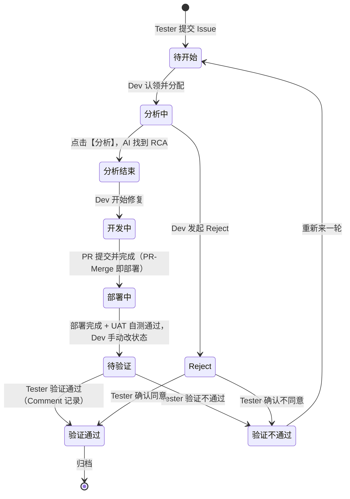

# AI Sherlock Issue 状态标准

> 本文档定义 Issue 从提交到验证通过的全生命周期状态标准。所有状态流转均通过公司内部 JIRA Workflow 处理，插件端与后端按本标准联动展示。

## 1. 状态总览

| # | 状态 | 触发人 | 进入条件 | 该阶段做什么 | 退出动作 |
|---:|---|---|---|---|---|
| 1 | **待开始** | Tester | 提交 Issue（JIRA 默认状态，即空状态的初始态） | Dev 在看板认领 Issue | Dev 分配后改为【分析中】 |
| 2 | **分析中** | Dev | Dev 领取并分配 Issue | 可在 Comment 补充信息（也可不填，保留该能力） | 信息填齐后点击【分析】按钮 |
| 3 | **分析结束** | 系统 | 点击分析触发 AI 分析，直到找到 RCA | RCA 信息推送到插件端，供 Tester 查看 | Dev 改为【开发中】 |
| 4 | **开发中** | Dev | Dev 开始修复 | 手动提交 PR，或通过 AutoFix 生成 PR；提交 PR 后点击完成 | 状态变为【部署中】 |
| 5 | **部署中** | Dev | PR 完成（外网 PR-Merge 即视为部署） | 提交 JIRA 部署单 | 部署完成（不设额外状态） |
| 6 | **待验证** | Dev | 部署完成且 UAT 自测没问题，Dev 手动改状态 | 插件端明显提示（如红点），等待 Tester 验证 | Tester 确认为【验证通过】或【验证不通过】 |
| 7 | **验证通过** | Tester | UAT 验证没问题，Comment 填写验证信息 | 可归档 | 归档，流程结束 |
| 8 | **验证不通过** | Tester | 验证发现问题，Comment 填写验证信息 | 等同于【待开始】 | 重新来一轮 |
| 9 | **Reject** | Dev | Dev 判定单据无需处理，发起 Reject | 提示 Tester 做确认 | 同意 → 等同【验证通过】；不同意 → 等同【验证不通过】，回【待开始】再来一轮 |

## 2. 状态流转图

## 3. 各阶段详细说明

### 3.1 待开始（Tester 提交）

Tester 提交 Issue 后，单据处于【待开始】——即 JIRA 默认的初始状态（无任何额外标记）。

### 3.2 分析中（Dev 认领）

Dev 在后台分配到 Issue 后，将状态改为【分析中】。

- Dev 可以在 Comment 里补充信息，也可以什么都不填（保留补充信息的能力）。
- 公司内部用 JIRA 的 Workflow 处理。

### 3.3 分析结束（AI 完成 RCA）

上面的信息填好后，点击【分析】按钮触发 AI 分析，直到找到 RCA（Root Cause）。

- 状态置为【分析结束】。
- **进入该状态时，RCA 信息推送给插件端**，供 Tester 查看。
- 公司内部用 JIRA 的 Workflow 处理。

### 3.4 开发中（Dev 修复）

Dev 把状态改为【开发中】，开始修复：

- 可以手动提交 PR，也可以走 AutoFix 生成 PR。
- 提交 PR 后点击完成。
- 公司内部用 JIRA 的 Workflow 处理。

### 3.5 部署中（PR-Merge 即部署）

状态变为【部署中】。

- 外网环境 PR-Merge 即视为部署。
- 部署动作 = 提交 JIRA 部署单。
- 公司内部用 JIRA 的 Workflow 处理。

### 3.6 待验证（Dev 手动置入）

部署完成后**不需要额外状态**。Dev 在 UAT 自测，确认没问题后，手动把状态改为【待验证】。公司内部用 JIRA 的 Workflow 处理。

### 3.7 待验证 → 验证通过 / 验证不通过（Tester 确认）

【待验证】状态下：

- **扩展插件端明显提示**（例如上红点），Tester 可以很明确地看到该状态，点击进入详情查看。
- Tester 验证没问题：Comment 填写验证信息，状态确认为【验证通过】。
- Tester 验证有问题：状态确认为【验证不通过】。
- 公司内部用 JIRA 的 Workflow 处理。

后续分支：

| 结果 | 处理 |
|---|---|
| 【验证通过】 | 可以归档；Chrome 插件可专门增加一个**归档 Tab** |
| 【验证不通过】 | 等同于【待开始】，重新来一轮 |

### 3.8 Dev Reject 单据

还有一种 DEV【Reject】的单子，同样提示给 Tester 做确认：

| Tester 决定 | 结果 |
|---|---|
| 同意 | 等同【验证通过】 |
| 不同意 | 等同【验证不通过】 → 回到【待开始】，再来一轮 |

## 4. 插件端联动要求

| 状态 | 插件端行为 |
|---|---|
| 分析结束 | RCA 信息同步到插件端，Tester 在 Case 详情的 Root Cause 中查看 |
| 待验证 | 列表/Tab 明显提示（红点），Tester 点击进入详情验证 |
| 验证通过 | 支持归档；可增加归档 Tab |
| 验证不通过 / Reject 待确认 | 提示 Tester 确认；不同意则回到【待开始】重新一轮 |

## 5. 与后端 Case 状态的对应（待对齐）

当前后端 `GET /api/v1/cases` 的 `status` 为技术态枚举（`RECEIVED` / `DIAGNOSED` / `FAILED` 等），与本标准的 JIRA 业务态需要建立映射，插件端才能按本标准展示红点、归档等提示。初步对应建议：

| JIRA 业务状态 | 后端 Case 状态（建议） |
|---|---|
| 待开始 / 分析中 | `RECEIVED` |
| 分析结束 | `DIAGNOSED` |
| 开发中 / 部署中 / 待验证 | 需后端新增或由 JIRA 同步 |
| 验证通过 / 验证不通过 | 需后端新增或由 JIRA 同步 |

> 具体映射方案需与后端、JIRA Workflow 配置方对齐后另行更新本节。
